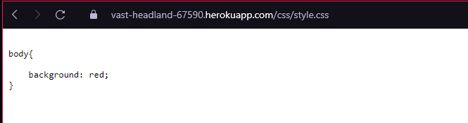
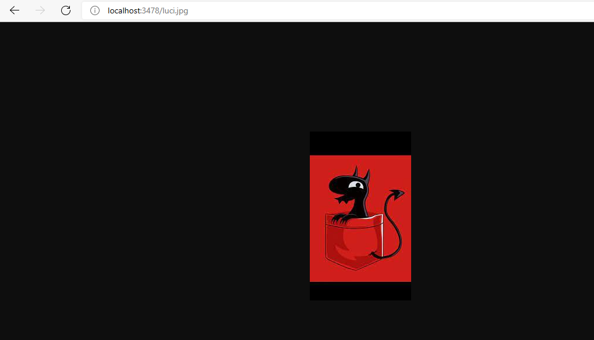

# Clientes y servicios

### Autor: Edward Daniel Porras Martin

### Despliegue Heroku

### Prerequisitos

Para la ejecucion de la aplicacion de manera local se nesecita:

- Java 8
- Maven
- git

### Instalación

- Se debe clonar el proyecto desde la consola de la maquina
  `https://github.com/Daniel19902/ClientesYServicios.git`

- Entrar a la carpeta clonada `cd ClientesYServicios`

- Se debe ejecutar un comando de Maven para comprobar el funcionamiento `mvn package`

# Ejecución

### Linux
`java -cp target/classes:target/dependency/* edu.escuelaing.arem.Reto1Http`

### Windows

`java -cp target/classes;target/dependency/* edu.escuelaing.arem.Reto1Http`

# Reto1

Escriba un servidor web que soporte múlltiples solicitudes seguidas (no concurrentes). El servidor debe retornar todos los archivos solicitados, incluyendo páginas html e imágenes. Construya un sitio web con javascript para probar su servidor. Despliegue su solución en Heroku. NO use frameworks web como Spark o Spring use solo Java y las librerías para manejo de la red.

Se le realizo para retornar formato html, jpg, js y css

Para obtner un archivo html enviamos como path [http://localhost:3478/index.html](http://localhost:3478/index.html)

Para obtner un archivo js enviamos como path [http://localhost:3478/js/socket.js](http://localhost:3478/js/socket.js)

Para obtner un archivo css enviamos como path [http://localhost:3478/css/style.css](http://localhost:3478/css/style.css)

Para obtner una imagen jpg enviamos como path [http://localhost:3478/luci.jpg](http://localhost:3478/luci.jpg)

# Licencias

En este proyecto se usó la licencia GNU - se puede ver [LICENSE](LICENSE.txt) para más detalles.